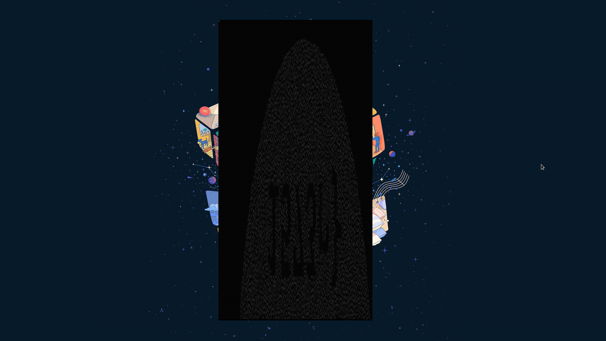

# Colour Blind

* Open the file in ```vim```. 
* Use ```:%!xxd``` to edit it in hex. 
* Use ```^V``` (visual block mode) to trim down to just the decoded part. 
* Use ```:%s/\n//g``` to remove all linebreaks. 
* Turn on word-wrap with ```:set wrap```, zoom out, and adjust window size until the image forms. 

