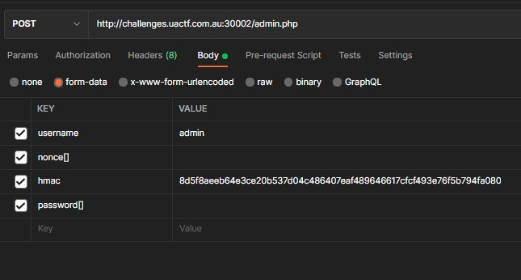

# Juggler

## Solution

Here your goal is for all 3 equality inside the if to be satisfied:
```php
// From admin.php
...

  if (strcmp($_POST['username'], "admin") == 0 &&
    strcmp($_POST['password'], $password) == 0 &&
    $_POST['hmac'] === $hmac)
    echo "<p style='color:green'>Login successful! Here is your flag: {$flag}</p>";
  else
    echo "<p style='color:red'>Your credentials are incorrect, please try again!</p>";

...
```

#### 1. `strcmp($_POST['username'], "admin" == 0`
Just use "admin" for the username input.

#### 2. `strcmp($_POST['password'], $password) == 0`
There is a [`strcmp` exploit](https://www.doyler.net/security-not-included/bypassing-php-strcmp-abctf2016) in php where if `a` is an array, `strcmp(a, b)` will return `NULL` no matter what `b` is.

Since `NULL == 0` is true, if we made `$_POST['password']` into an array, it does not matter what `$password` is, the equality will always be satisfied.

In order to [make the server receive a form data field as an array](https://stackoverflow.com/a/9547490/12826774), you can actually change the field name from `password` to `password[]`. The server will receive an empty array for the password if you set the value to an empty string.

#### 3. `$_POST['hmac'] === $hmac`
The `$hmac` value is calculated as follows in the server:
```php
$secret = hash_hmac('sha256', $_POST['nonce'], $secret);
$hmac = hash_hmac('sha256', $_POST['username'], $secret);
```
The `$secret` is not known, so normally it is not possible to calculate the `$hmac`.

However, feeding in an array as the data will return `NULL`. So if we send `$_POST['nonce']` as an array, `$hmac` will be predictable. And can be calculated inside any php runtime:
```php
echo hash_hmac('sha256', "admin", NULL);
// always return '8d5f8aeeb64e3ce20b537d04c486407eaf489646617cfcf493e76f5b794fa080'
```

By sending a request straight from postman, you can get the solution.

