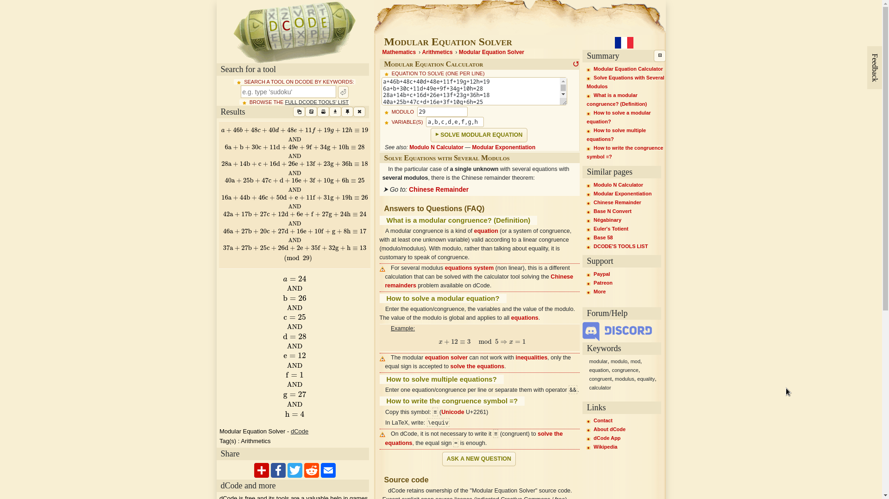

# Lighthouse

* Quick look at the files in ```src/dist```: 
    * ```kN.js``` reveal the numbers that each dial turns itself and others by. 
    * ```setup.js``` reveals the end goal. 
* Realise that the solution can be derived from a system of linear modular equations. 
<!---
* Try to do it by hand for god knows how long. 
* Mess up multiple times. 
* Realise that you switched the rows and columns. 
* Give up momentarily from burnout. 
* Realize there is probably a modular equation solver. 
* flag{why_d1d_1_ju57_d0_7h47}
--->
* Look up a [modular equation solver](https://www.dcode.fr/modular-equation-solver)
* Use the numbers in each ```kN.js``` as the columns of coefficients. 
* Use the numbers in ```setup.js``` as the constants. 
* Use the letters a to h as variables. 
* Since the dials have 29 positions, set the modulo as 29. 
* Result: 


This solution was a collaborative effort with [@covector](https://github.com/covector). 
