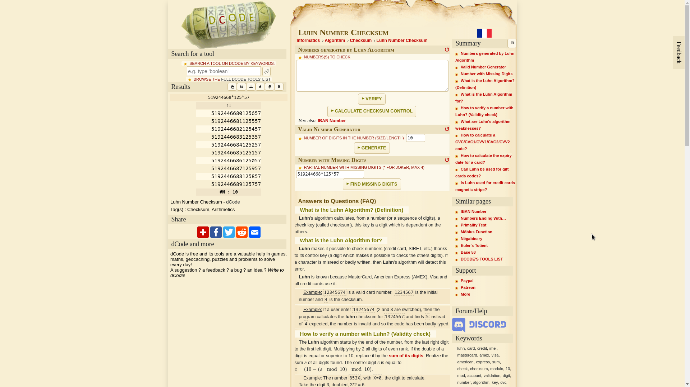

# Peter works at Bendigo

* Notice that the first 6 digits of a payment card is the [issuer identification number](https://en.wikipedia.org/wiki/Payment_card_number#Issuer_identification_number_(IIN)). 
* Notice that the card is a debit Mastercard from Bendigo Bank. 
* Look up a [list of IINs](https://stevemorse.org/ssn/List_of_Bank_Identification_Numbers.html). 
* There are only 2 possible IINs for this card. 
* Use a [Luhn algorithm checker](https://www.dcode.fr/luhn-algorithm) to find the rest of the digits. 

Not a perfect solution but at least narrows it down to just 20 possibilities. 

This solution was a collaborative effort with @covector. 
